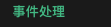

## 基础

1. reactive&ref

2. nextTick() => {}

3. computed计算属性和普通方法的区别, get&set

4. v-bind:class  == :class | :style | 

   ```vue
   <div :style="{ color: activeColor, fontSize: fontSize + 'px' }"></div>
   ```

5. v-if&v-else条件渲染, v-show

    ```vue
    <button @click="awesome = !awesome">Toggle</button>
    <h1 v-if="awesome">Vue is awesome!</h1>
    <h1 v-else>Oh no 😢</h1>
    
    <h1 v-show="ok">Hello!</h1>
    ```

    v-show添加css样式display, v-if 是直接不渲染,`v-if` 有更高的切换开销，而 `v-show` 有更高的初始渲染开销。因此，如果需要频繁切换，则使用 `v-show` 较好；如果在运行时绑定条件很少改变，则 `v-if` 会更合适。

6. v-for

    1. val in arr

    2. (val, index) in arr 

    3. v-for与对象

        ```vue
        <li v-for="(value, key, index) in myObject">
          {{ index }}. {{ key }}: {{ value }}
        </li>
        ```

    4. 传入组件props

        ```vue
        <MyComponent
          v-for="(item, index) in items"
          :item="item"
          :index="index"
          :key="item.id"
        />
        ```

7. 