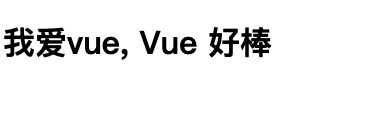

- MVVM: model-view-view-model
  - vue实现：view-model层
- VUE的特点：
  - 组件化开发，比如一个下拉框样式，应该是所有使用到的地方可以适用的，而不是仅某个地方使用
  - ??声明式编程


下面开始一个简单的vue页面

#### 简单引入

```vue
<!DOCTYPE html>
<html lang="zh">
<head>
    <!-- 引入vue -->
    <script src="https://unpkg.com/vue@3/dist/vue.global.js"></script>
</head>
<body>
    <!-- script中app绑定到了id=app中 显示root的所有内容 -->
    <div id="app"></div>
    <script>
        // 编写vue代码
        const Root = {
            template:"<h1>我爱vue</h1>"
        }
        // 创建实例 并挂载在id=app
        const app = Vue.createApp(Root).mount('#app')
    </script>
</body>
</html>
```

通过id=app绑定到Root，可以在id=app的div中显示Root(template)的内容

#### data变量引入

下面是变量的引用，类似js中的变量嵌套在html中,  `{{var}}`格式即可引用声明的变量，例如下面的message

```vue
<!DOCTYPE html>
<html lang="zh">
<head>
    <!-- 引入vue -->
    <script src="https://unpkg.com/vue@3/dist/vue.global.js"></script>
</head>
<body>
    <!-- script中app绑定到了id=app中 显示root的所有内容 -->
    <div id="app"></div>
    <script>
        // 编写vue代码
        const Root = {
            data(){
                return {
                    // 声明变量
                    message: "Vue 好棒"
                }
            },
            // 组件中使用变量message: {{}}格式引用
            template:"<h1>我爱vue, {{message}}</h1>"
        }
        // 创建实例 并挂载在id=app
        const app = Vue.createApp(Root).mount('#app')
    </script>
</body>
</html>
```

运行结果：



>  这样我们开始了第一课，使用简单的vue

```vue
<!DOCTYPE html>
<html lang="zh">
<head>
    <!-- 引入vue -->
    <script src="https://unpkg.com/vue@3/dist/vue.global.js"></script>
</head>
<body>
    <!-- script中app绑定到了id=app中 显示root的所有内容 -->
    <div id="app"></div>
    <script>
        // 编写vue代码
        const Root = {
            data(){
                return {
                    // 声明变量
                    count:0,
                }
            },
            // 组件中使用变量@click绑定变量 {{}}格式引用
            template: "<button @click='count++'>点我</button>{{count}}"
        }
        // 创建实例 并挂载在id=app
        const app = Vue.createApp(Root).mount('#app')
    </script>
</body>
</html>
```