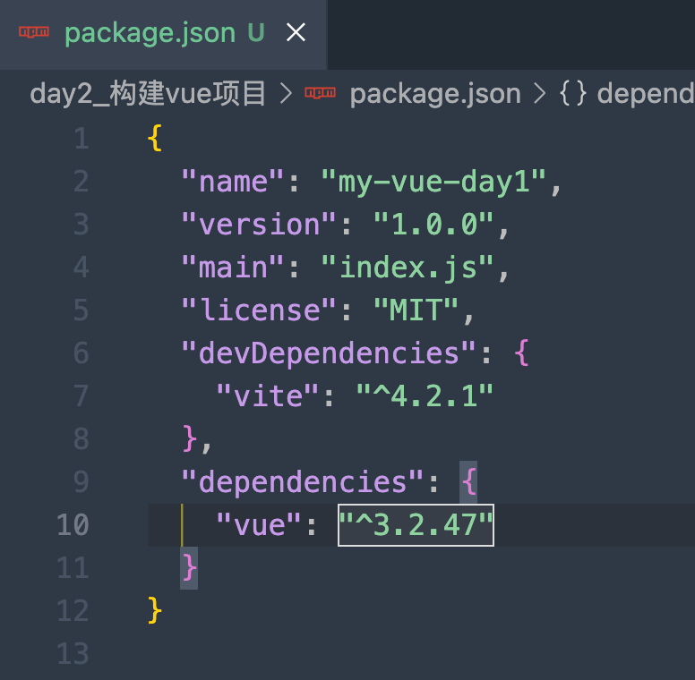
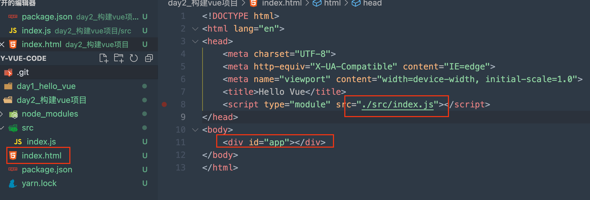
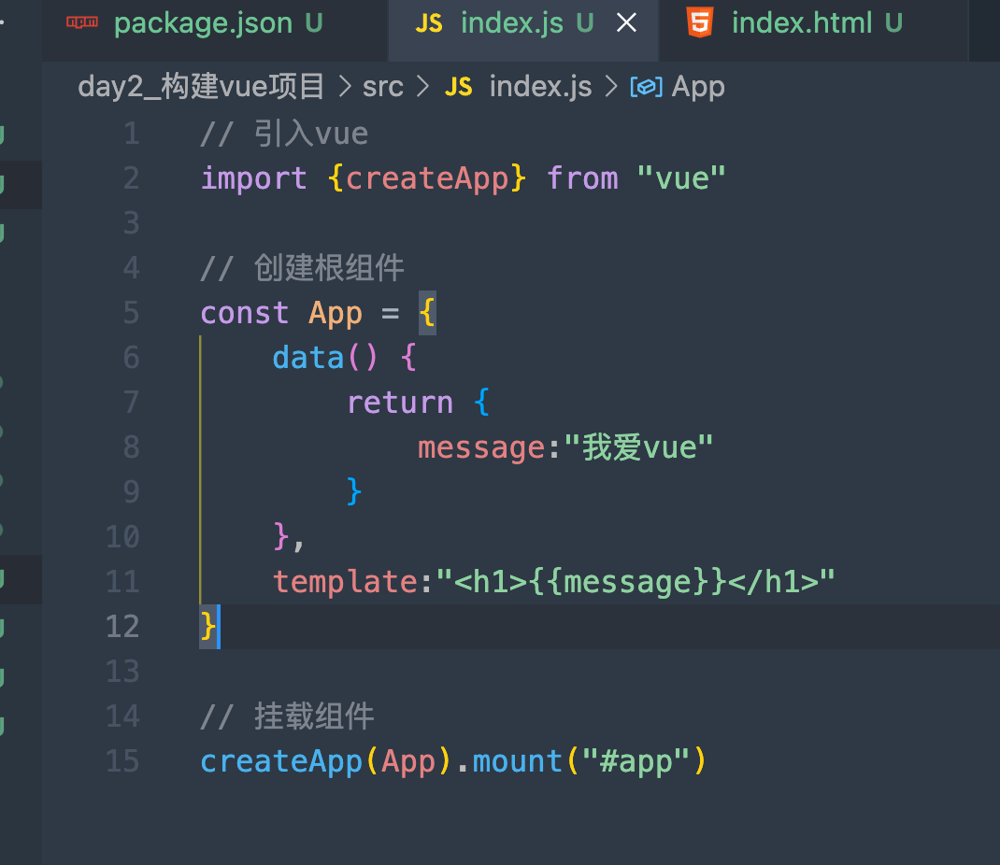
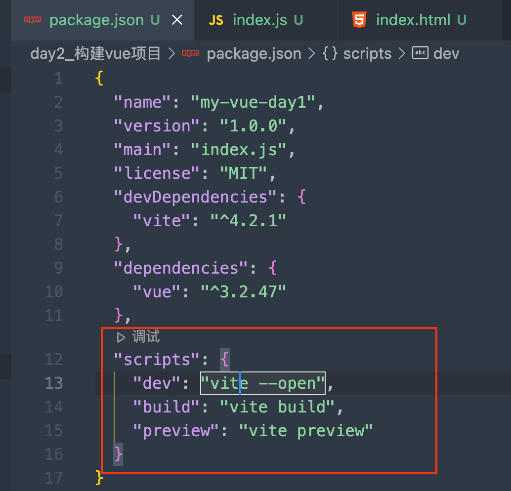
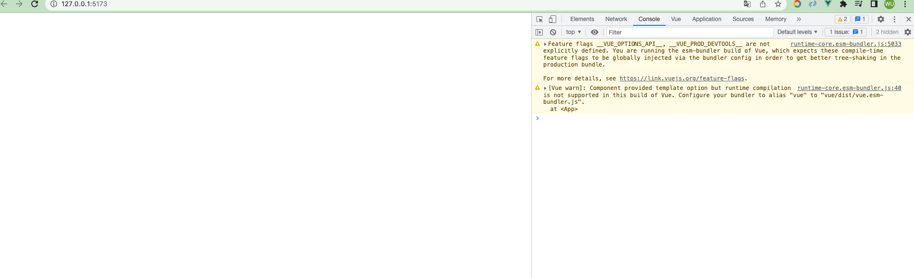
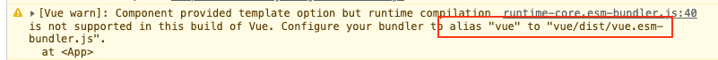
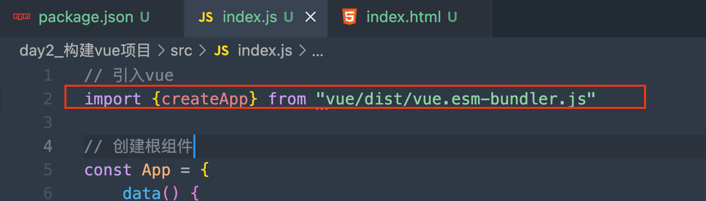
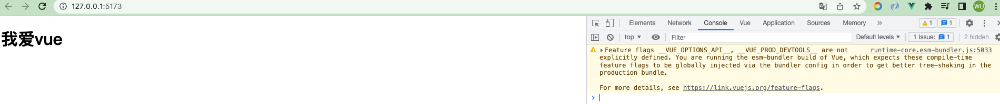

- yarn init -y初始化项目
- yarn add -D vite 打包工具安装
- yarn add vue 安装vue依赖

### 创建index.html & src/index.js文件

在index.html中引入src/index.js， 并初始化body id=app进行绑定

接下来我们在index.js进行vue的编写

我们来试着运行， 先编写下脚手架(用命令进行构建运行,有点像makefile格式)

接下来，用`yarn dev`cmd命令我们就可以执行运行项目

怎么什么都没有。。。

是因为vue默认版本不支持template， 我们可以将vue换成`vue/dist/vue.esm-bundler.js`

这样页面就有效果了

