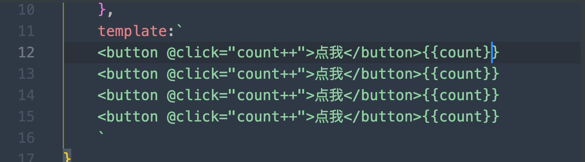

### 构建工具创建项目

- yarn init -y初始化项目
- yarn add -D vite 打包工具安装
- yarn add vue 安装vue依赖


#### 创建index.html & src/index.js文件

在index.html中引入src/index.js， 并初始化body id=app进行绑定


接下来我们在index.js进行vue的编写


我们来试着运行， 先编写下脚手架(用命令进行构建运行,有点像makefile格式)


接下来，用`yarn dev`cmd命令我们就可以执行运行项目


怎么什么都没有。。。


是因为vue默认版本不支持template， 我们可以将vue换成`vue/dist/vue.esm-bundler.js`


这样页面就有效果了


在此的基础上，我们添加一个`button点击计数`的功能,在src/index.js中我们写下这样的代码：

```vue
// 引入vue
import {createApp} from "vue/dist/vue.esm-bundler.js"

// 创建根组件
const App = {
    data() {
        return {
            count:0
        }
    },
    template:`<button @click="count++">点我</button>{{count}}`
}

// 挂载组件
createApp(App).mount("#app")
```

`yarn dev`查看效果


如果此时v2版本需要多个点击按钮呢



我们添加了这么多的按钮


#### 按钮组件化

但是发现点击某一个时，其他的计数也会更新，这是因为他们公用data().count变量

如何解决呢

我们可以将计数按钮封装成一个组件，然后引入到任意的模块中，就能解决这个问题

新建src/MyButton.js文件

```vue
export default {
    data() {
        return {
            count:0
        }
    },
    template:`
    <button @click="count++">点我</button>{{count}}
    `
}
```

这样我们就写好了一个按钮计数的组件， 然后引入到父组件src/index.js

- `import MyButton from "./MyButton"`注册组件
-  `components: {
          MyButton
      },`引入组件
- 在template中使用

```vue
// 引入vue
import {createApp} from "vue/dist/vue.esm-bundler.js"
// 引入组件
import MyButton from "./MyButton"
// 创建根组件
const App = {
    data() {
        return {
            count:0
        }
    },
    components: {
        MyButton
    },
    template:`
    <MyButton></MyButton>
    <MyButton></MyButton>
    <MyButton></MyButton>
    <MyButton></MyButton>
    `
}

// 挂载组件
createApp(App).mount("#app")
```

效果如下：


#### 引入vue格式文件

在上面我们引入了组件化按钮，但是`template`模块还是比较原始，在vue开发中，我们可以用`MyButton.vue`来创建一个vue格式的文件， 当然名称修改，内容格式也会发生变化

`MyButton.vue`

```vue
<template>
    <button @click="count++">点我</button>{{count}}
</template>

<script>
    export default {
        data() {
            return {
                count:0
            }
        }
    }
</script>
```

较比之前，template模块代码专门写在了`<template>`模块中，比起之前的字符串没有提示符舒服多了，而我们的export相关内容，也写在了`<script>`中, 而我们在引入该文件时

`App.vue`

```vue
<template>
    <h1>{{ msg }}</h1>
    <MyButton></MyButton>
</template>

<script>
    // 引入button
    import MyButton from './components/MyButton.vue'
    export default {
        data() {
            return {
                msg:"我超级爱VUE"
            }
        },
        // 使用button
        components:{
            MyButton
        }
    }
</script>
```

这样我们就完成了一个js -> vue开发转换的过程,但是现在我们的项目不能跑起来，因为浏览器不能认识vue的`<template>`这些格式语法，我们需要通过一个转换功能，在页面显示之前进行`翻译工作`，将vue的语法转换成js即浏览器可以认识的语法

- `yarn add  -D @vitejs/plugin-vue`安装翻译的插件

- 根目录新建`vite.config.js`

  ```js
  import vue from "@vitejs/plugin-vue"
  
  export default {
      plugins:[vue()]
  }
  ```

- 最后再用`yarn dev启动即可`

  `package.json`

  ```json
  {
    "name": "03_vue_file",
    "version": "1.0.0",
    "main": "index.js",
    "license": "MIT",
    "devDependencies": {
      "@esbuild/darwin-arm64": "^0.17.16",
      "vite": "^4.2.1"
    },
    "dependencies": {
      "@vitejs/plugin-vue": "^4.1.0",
      "vue": "^3.2.47"
    },
    "scripts": {
      "dev": "vite --open",
      "build": "vite build"
    }
  }
  
  ```

  页面如下：

  

> 到此，我们算是真正入门了vue的第一课，使用vue语法创建一个组件并在某个页面中使用该组件


