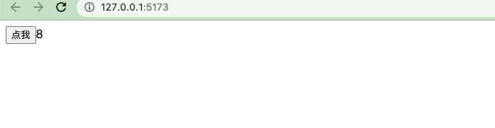
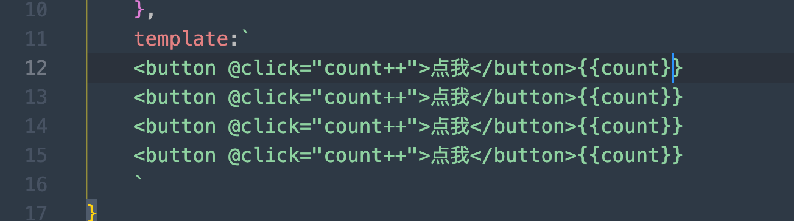
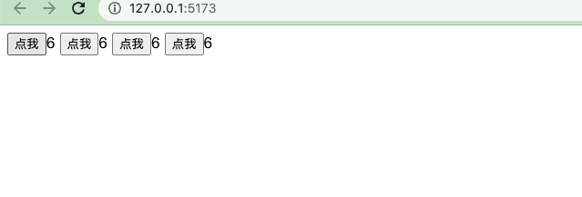
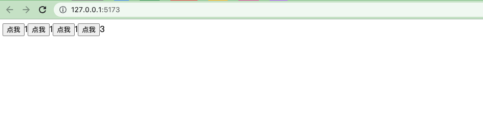

在day2的基础上，我们添加一个`button点击计数`的功能,在src/index.js中我们写下这样的代码：

```vue
// 引入vue
import {createApp} from "vue/dist/vue.esm-bundler.js"

// 创建根组件
const App = {
    data() {
        return {
            count:0
        }
    },
    template:`<button @click="count++">点我</button>{{count}}`
}

// 挂载组件
createApp(App).mount("#app")
```

`yarn dev`查看效果



如果此时v2版本需要多个点击按钮呢



我们添加了这么多的按钮



但是发现点击某一个时，其他的计数也会更新，这是因为他们公用data().count变量

如何解决呢

我们可以将计数按钮封装成一个组件，然后引入到任意的模块中，就能解决这个问题

新建src/MyButton.js文件

```vue
export default {
    data() {
        return {
            count:0
        }
    },
    template:`
    <button @click="count++">点我</button>{{count}}
    `
}
```

这样我们就写好了一个按钮计数的组件， 然后引入到父组件src/index.js

- `import MyButton from "./MyButton"`注册组件
-  `components: {
          MyButton
      },`引入组件
- 在template中使用

```vue
// 引入vue
import {createApp} from "vue/dist/vue.esm-bundler.js"
// 引入组件
import MyButton from "./MyButton"
// 创建根组件
const App = {
    data() {
        return {
            count:0
        }
    },
    components: {
        MyButton
    },
    template:`
    <MyButton></MyButton>
    <MyButton></MyButton>
    <MyButton></MyButton>
    <MyButton></MyButton>
    `
}

// 挂载组件
createApp(App).mount("#app")
```

效果如下：



