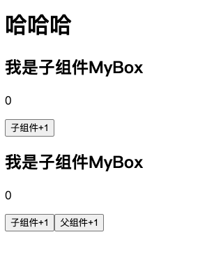
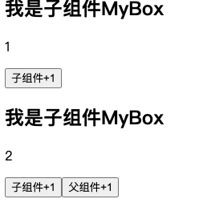

在前面使用子组件/父组件中都是单一的html页面，但实际开发中，多数情况是动态加载数据变量。但子组件的数据内容可能来自不同页面的不同接口，这是就需要通过父组件先调用接口 将变量拿到后传递到子组件进行渲染， 其中传递的关键字叫做`props`

```vue
// 子组件 Button.vue
<script>
const props = defineProps(["a","b","c"])
</script>

// 父组件
<button a="父组件a" b="父组件b" c="父组件c"></button>
```


## 传递变量

如何将父组件中的变量绑定到子组件使用 `:var="var"`

```vue
<script setup>
  import mybox from './components/mybox.vue';
  import {ref} from "vue"
  const count = ref(0)
</script>

<template>
  <h1>哈哈哈</h1>
  <!-- 将count变量传递给子组件 -->
  <mybox :count="count"></mybox>
</template>
```


### 扩展

惊奇的是，我在父组件中修改count, 以及多个子组件中修改父组件传递的count，会产生不同的效果

```vue
// 父组件
<script setup>
  import mybox from './components/mybox.vue';
  import {ref} from "vue"
  const count = ref(0)
</script>

<template>
  <h1>哈哈哈</h1>
  <!-- 引用两个子组件 -->
  <mybox :count="count"></mybox>
  <mybox :count="count"></mybox>
  <!-- 并且本身父组件有修改count -->
  <button @click="count++">父组件+1</button>
</template>

// 子组件
<script setup>
    const props = defineProps(["count"])
</script>

<template>
    <h2>我是子组件MyBox</h2>
    <p>{{ props.count }}</p>
    <button @click="count++">子组件+1</button>
</template>
```



首先初始化页面是这样的

#### 验证子组件中修改是否会冲突

点击上面子组件按钮以及下面子组件按钮，



可以看到是符合预期的，各自不影响

#### 验证父组件修改是否会影响子组件

在上面的基础上，我们点击一次父组件+1按钮


我们可以看到下面子组件被更新成1，但如果继续点击各个子组件按钮又会从1开始递增，互不影响

根据上面这个现象，我们思考总结一下

#### 总结

1. 子组件之间复用的父组件变量不是共用的(值拷贝)
2. 父组件变量更新将会覆盖更新使用该变量的子组件值

> 针对上面这个情况，我们需要注意在开发时候，尽量不要将变量的更新分散在各个地方(组件), 应随着ref/reactive定义的地方进行修改，以免产生莫名的数据错误


## 附录

- [官网props](https://cn.vuejs.org/guide/components/props.html)